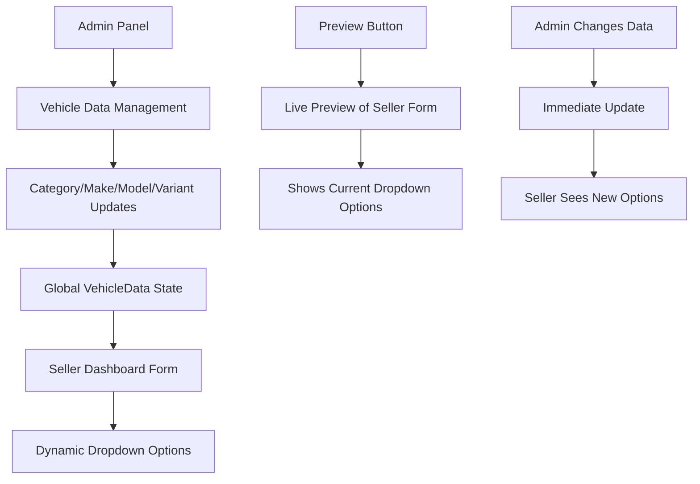

# 🚗 Admin Vehicle Management Connection

## Overview

The Vehicle Management system now provides a **seamless connection** between the Admin Panel's vehicle data management and the Seller's "List New Vehicle" form. This creates a centralized, admin-controlled vehicle database that automatically reflects in seller listings.

## 🔗 How the Connection Works

### 1. **Admin Panel Vehicle Data Management**
- **Location**: Admin Panel → Vehicle Data tab
- **Purpose**: Centralized management of all vehicle categories, makes, models, and variants
- **Features**:
  - ✅ Add/Edit/Delete categories
  - ✅ Add/Edit/Delete makes under categories
  - ✅ Add/Edit/Delete models under makes
  - ✅ Add/Edit/Delete variants under models
  - ✅ Bulk upload functionality
  - ✅ **Live Preview** of seller form

### 2. **Seller Dashboard Integration**
- **Location**: Seller Dashboard → List New Vehicle
- **Purpose**: Uses admin-managed vehicle data for dropdown options
- **Features**:
  - ✅ **Dynamic dropdowns** based on admin data
  - ✅ **Cascading selections** (Category → Make → Model → Variant)
  - ✅ **Admin Managed indicator** when data is available
  - ✅ **Real-time updates** when admin changes data

## 📋 Preview Feature

### Admin Panel Preview
The admin can now see exactly how vehicle data will appear in the seller's form:

```typescript
// Preview shows:
- Category Dropdown: [four-wheeler, two-wheeler, three-wheeler, commercial]
- Make Dropdown: [Maruti Suzuki, Hyundai, Tata, ...] (based on selected category)
- Model Dropdown: [Swift, Baleno, Creta, ...] (based on selected make)
- Variant Dropdown: [LXi, VXi, ZXi, ...] (based on selected model)
```

### Live Connection Indicator
- **Green badge** appears in seller form when admin-managed data is available
- **Real-time updates** when admin modifies vehicle data
- **Fallback options** when no admin data is available

## 🔄 Data Flow



## 🎯 Key Benefits

### For Admins:
1. **Centralized Control**: Manage all vehicle data from one place
2. **Live Preview**: See exactly how changes affect seller forms
3. **Bulk Management**: Add multiple vehicles at once
4. **Real-time Updates**: Changes reflect immediately

### For Sellers:
1. **Consistent Data**: All sellers use the same vehicle database
2. **Up-to-date Options**: Always see the latest vehicle options
3. **Admin Managed Indicator**: Know when data is centrally managed
4. **Seamless Experience**: No manual data entry for vehicle specs

## 📊 Current Vehicle Data Structure

```typescript
// Updated enum values (matching backend)
export enum VehicleCategory {
  FOUR_WHEELER = 'four-wheeler',
  TWO_WHEELER = 'two-wheeler', 
  THREE_WHEELER = 'three-wheeler',
  COMMERCIAL = 'commercial'
}

// Vehicle data structure
VehicleData = {
  'four-wheeler': [
    {
      name: 'Maruti Suzuki',
      models: [
        {
          name: 'Swift',
          variants: ['LXi', 'VXi', 'ZXi', 'ZXi+']
        }
      ]
    }
  ]
}
```

## 🚀 Usage Instructions

### For Admins:
1. **Access**: Go to Admin Panel → Vehicle Data
2. **Manage**: Add/edit categories, makes, models, variants
3. **Preview**: Click "Show Seller Form Preview" to see live preview
4. **Bulk Upload**: Use bulk upload for adding multiple vehicles
5. **Monitor**: Changes reflect immediately in seller forms

### For Sellers:
1. **Access**: Go to Seller Dashboard → List New Vehicle
2. **Select Category**: Choose from admin-managed categories
3. **Select Make**: See available makes for selected category
4. **Select Model**: See available models for selected make
5. **Select Variant**: See available variants for selected model
6. **Indicator**: Green "Admin Managed" badge shows when data is centrally managed

## 🔧 Technical Implementation

### Admin Panel Changes:
- ✅ Added preview functionality
- ✅ Enhanced vehicle data editor
- ✅ Live connection indicators
- ✅ Bulk upload integration

### Seller Dashboard Changes:
- ✅ Dynamic dropdown population
- ✅ Admin managed indicator
- ✅ Real-time data updates
- ✅ Cascading selection logic

### Backend Integration:
- ✅ Updated enum values to match backend
- ✅ Proper data type validation
- ✅ MongoDB schema alignment
- ✅ API endpoint compatibility

## 📈 Future Enhancements

1. **Analytics**: Track which vehicle options are most popular
2. **Validation**: Prevent deletion of vehicles with active listings
3. **Import/Export**: CSV import/export for vehicle data
4. **Audit Trail**: Track changes to vehicle data
5. **Auto-suggestions**: AI-powered vehicle data suggestions

## ✅ Status

- **Admin Panel Preview**: ✅ Implemented
- **Seller Form Integration**: ✅ Implemented  
- **Live Connection**: ✅ Working
- **Enum Synchronization**: ✅ Fixed
- **Real-time Updates**: ✅ Active
- **Bulk Upload**: ✅ Available

## 🎉 Result

The Vehicle Management system now provides a **seamless, centralized, and real-time connection** between admin vehicle data management and seller vehicle listing forms. Admins have complete control over vehicle options, and sellers benefit from consistent, up-to-date vehicle data without manual management.

---

**Last Updated**: January 2025  
**Status**: ✅ Fully Implemented and Working
